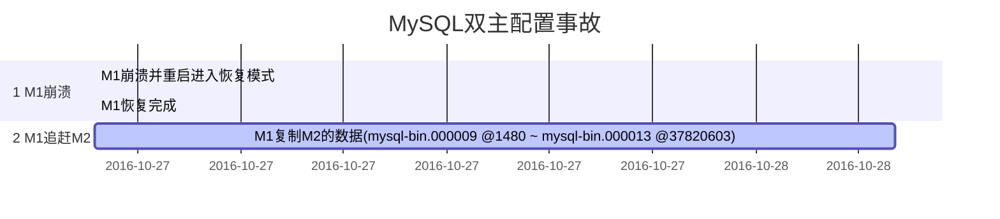

# MySQL 5.7 复制机制

副本复制使数据可以从一个MySQL数据库服务器（master节点）拷贝到一个或者多个MySQL数据库服务器中（slave节点）。默认情况下复制过程是异步的，slave节点无需和master节点一直保持连接来获取更新。更具配置不同，用户可以复制所有的数据库或者选择一部分数据库，或者选择一部分表进行同步。

MySQL的复制机制的优点包括：

* 横向扩展方案。将负载分布在多个slave节点上提高性能。在这种环境下，所有的写操作和更新操作都必须在master服务器上完成。但是读操作可以在一个或者多个slave节点上进行。这个模型可以提高写性能（因为master只负责更新），同时随着slave数量的增加显著提高读性能。
* 数据安全。因为数据复制到了slave节点上，并且slave节点可以暂停复制过程，这样就可以在slave节点上进行备份服务而无需破坏master节点上的相应数据。
* 分析。活跃的数据在master节点上传进，同时可以在slave节点上进行分析而不影响master节点的性能
* 远距离数据分布。可以利用复制技术为远程站点创建本地数据副本，而无需持续访问master节点。


## 复制方法

MySQL5.7支持两种不同的复制方法。传统的方法是基于master节点的bin log复制事件，这需要在master节点和slave节点之间保持日志文件和位置的同步。新的方法基于去阿奴事务标识符（GTIDs），这种机制是具有事务性因此不需要日志文件或者这些文件中的位置信息，这也极大的简化了很多通用的复制任务。只要在master节点上提交的所有事务都已经应用到了slave节点，使用GTIDs的复制方法可以保证master和slave节点之间的一致性。关于GTIDs和基于GTID的复制可以参考[16.1.3节, “使用全局事务标识符的复制”](https://dev.mysql.com/doc/refman/5.7/en/replication-gtids.html)。

## 复制同步

MySQL支持多种不同的复制同步模式。原始的同步类型是单向的异步复制，这种模式下一个服务器扮演master角色，同时一个或者多个服务器扮演slave角色。这种模式与NDB集群的特种模式“同步复制”不同。在MySQL5.7中在内置的异步复制之外还支持半同步复制模式，这种模式下，在master节点上的一个事务提交在返回给操作该事务的会话之前会一直阻塞，直至至少有一个slave节点回复它已经接受到了事务事件，并将其记录到了日志中。详情参考[16.3.9 半同步复制](https://dev.mysql.com/doc/refman/5.7/en/replication-semisync.html)。MySQL5.7还支持延迟复制，这种模式下slave服务至少比master节点延后一定时间，详情参考[16.3.10 延迟的复制](https://dev.mysql.com/doc/refman/5.7/en/replication-delayed.html)。


## 复制格式

有两种核心的副本格式：

* 基于语句的复制（Statement Based Replication, SBR），MySQL 3.2.3引入
* 基于行的复制（Row Based Replication, RBR），MySQL 5.1引入

SBR会复制完整的SQL语句，而RBR值复制改变的行。也可以使用第三种变体格式：

* 混合模式复制（Mixed Based Replication，MBR）

关于不同地方复制格式可以参考[16.2.1节 复制格式](https://dev.mysql.com/doc/refman/5.7/en/replication-formats.html)

在MySQL 5.7.7之前，默认采用为基于语句的格式，MySQL5.7.7及以后的版本默认采用基于行的格式。

对于**NDB集群**，其默认的二进制日志格式为，MySQL NDB 7.5为混合模式。但是需要注意的是NDB集群复制总是采用基于行的复制，并且[NDB](https://dev.mysql.com/doc/refman/5.7/en/mysql-cluster.html)存储引擎和基于语句的复制是不兼容的。

实际上，MySQL能够在两种复制模式之间动态切换，默认使用基于语句的复制。 MySQL5.7.7 默认使用基于语句的复制，5.7.7及其以后的版本默认采用基于行的复制。(https://dev.mysql.com/doc/refman/5.7/en/replication-formats.html)

复制都是通过在主库上记录二进制日志、在备库重放日志的方式来实现异步的数据复制。


## 全局事务标识符GTID 

全局事务标识符GTID是master节点上创建的与每个事务相关的唯一标识符，这个标识符不仅仅是在生成它的服务器上唯一，而且在整个集群中都是唯一的。也就是说所有的事务与所有的GTID之间是1对1的关系。

一个GTID由一对用冒号分隔的坐标组成，格式如下：

```shell
GTID= source_id:transaction_id
```

其中，source_id表示发起事务的源服务器，通常使用该服务器的server_uuid作为source_id。transaction_id是一个连续的序列，数值由事务在该服务器上提交的顺序决定。例如，提交的第一个事务以1作为transaction_id，同一台源服务器上的提交的第10个事务分配10作为transaction_id。注意：GTID不会使用0作为序列号。举例来说，假设提交事务的源服务器的UUID为3E11FA47-71CA-11E1-9E33-C80AA9429562，在这台服务器上提交的第20个事务的GTID为：3E11FA47-71CA-11E1-9E33-C80AA9429562:23.


### GTID集合

#### mysql.gtid_executed表

从MySQL5.7.5开始，GTID存储在mysql数据的gtid_executed表中。j表结构如下：

```sql
CREATE TABLE `gtid_executed` (
  `source_uuid` char(36) NOT NULL COMMENT 'uuid of the source where the transaction was originally executed.',
  `interval_start` bigint(20) NOT NULL COMMENT 'First number of interval.',
  `interval_end` bigint(20) NOT NULL COMMENT 'Last number of interval.',
  PRIMARY KEY (`source_uuid`,`interval_start`)
) ENGINE=InnoDB DEFAULT CHARSET=latin1; 
```

**注意**

只有gtid_mode是处于ON或者ON_PERMISSIVE状态，才会将GTID存储在mysql.gtid_exectued表中。

## 复制通道

MySQL5.7.6引入了复制通道的概念，用来表示从master节点到slave节点的传输流路径。为了保持前向兼容，MySQL服务器在启动时会自动创建一个名为空字符串（“”）的默认通道，默认通道永远都存在，用户无法通过手动来创建或者删除。如果没有其他命名通道存在，复制语句就会在默认通道上执行，从而保证旧版本slave节点的复制行为一致。

复制通道包括从master节点到slave节点的传输路径，在多源复制情况中，slave节点会为每个master节点打开一个通道，并且每个通道都有它自己的重放日志和应用线程（SQL线程）。如果一个通道的I/O接收线程收到了数据，这些数据会被添加到该通道的重放日志中，并将其传给应用线程。

复制通道也可以与主机名和端口关联，MySQL 5.7最多可以给一个slave节点配置*256*个通道。每个复制通道都必须有一个唯一的名字（非空），详情参考[16.2.3.4 复制通道命名规范](https://dev.mysql.com/doc/refman/5.7/en/channels-naming-conventions.html)。复制通道可以单独配置。


## 复制的限制

MySQL 的复制机制虽然很强大，但是也存在诸多限制：

- 主库与备库之间可能存在数据不一致，并且无法保证主备之间的延迟。
- 向后兼容，新版本的服务器可以作为老版本服务器的备库，反之不可行。
- 同一个主库上连接多个备库会导致主库开启多个复制线程从而增加主库的I/O开销。
- 备库可以提高读性能，但是写性能难以提高。


## 复制的原理

1. 主库按照事务提交的顺序在准备提交事务、完成数据更新前将数据记录到二进制日志。
2. 备库启动一个I/O线程与主库建立一个普通的客户端连接。
3. 备库通过step2建立的客户端连接在主库上启动一个特殊的二进制转储线程(binlog dump)。
4. step3中的转储线程读取主库上的二进制日志中的事件。如果该线程追赶上的主库进度，就进入睡眠状态，直到主库发送信号通知其有新的事件产生。
5. 备库的I/O线程将接收到的事件记录到中继日志中（relay log）。
6. 备库的SQL线程从中继日志中读取事件并在备库中执行，从而实现备库数据的更新

因为备库中只有一个SQL线程重放中继日志，主库上并发运行的查询在备库上只能串行执行。


## 复制拓扑

基本原则：

- 一个MySQL备库实例只能有一个主库
- 每个备库必须有一个唯一的服务器ID
- 一个主库可以有多个备库
- 如果打开了log_slave_updates选项，一个备库可以把其主库上的数据变化传播到其他备库


### 主动 - 被动模式下的主- 主复制

这种模式下，服务器的配置是对称的，从而便于切换主动和被动服务器。可以在不关闭服务器的情况下执行维护、优化表、升级操作系统或者其他任务。但是实际应用中这种模式存在一个严重的隐患，导致我们的线上环境出现过一次严重的事故。由于Master-Master模式下数据是可以互相备份的，一旦其中一台M1节点出现服务重启，之后它将从M2拷贝数据保持两者之间的同步。如果之前M2的bin log复制有问题，导致数据落后M1重启之前的数据，就可能出现M1数据被覆写的问题。具体案例附在后文。


配置主- 主服务器对

1. 确保M1和M2有相同的数据
2. 启用二进制日志 sync_binlog=1，选择唯一的服务器ID，并创建复制账号
3. 启用备库更新的日志记录


1. M2配置成readonly


1. 启动M1和M2
2. 将M1和M2互相设置为对方的备库，使用新创建的二进制日志开始工作


#### 主-主服务器配置

环境：

- M1: 192.168.1.123
- M2: 192.168.1.321 （read only）

其中M2作为只读server，实际上扮演M1的Slave角色。

授权：

```mysql
M1:

mysql > GRANT REPLICATION SLAVE,REPLICATION CLIENT ON . TO ‘zw_repl’@‘192.168.%’IDENTIFIED BY ‘passw0rd’;
mysql> FLUSH PRIVILEGES;

M2:
mysql > GRANT REPLICATION SLAVE,REPLICATION CLIENT ON . TO‘zw_repl’@‘192.168.%’IDENTIFIED BY ‘passw0rd’;
mysql> FLUSH PRIVILEGES;
```


配置文件：

M1：

```shell
server-id= 1
log-bin= /var/log/mysql/mysql-bin
log-slave-updates= 1                             # Enable slave spreading bin log
sync_binlog= 1                                   # Flushbin log before every transaction commitment

#MySQL 5.5+ options
sync_master_info= 1
sync_relay_log= 1
sync_relay_log_info=1

#InnoDB options
innodb_flush_logs_at_trx_commit= 1 # Flush every log write
innodb_support_xa = 1                          # MySQL 5.0+ only

#Slave options
relay_log= /var/log/mysql/relay-bin
skip_slave_start= 1                            # Forbidden slave autorestart after corruption
```

M2：

```shell
server-id= 2
log-bin= /var/log/mysql/mysql-bin
log-slave-updates= 1                             # Enable slave spreading bin log
sync_binlog= 1                                   # Flushbin log before every transaction commitment
 

#MySQL 5.5+ options
sync_master_info= 1
sync_relay_log= 1
sync_relay_log_info=1
 
#InnoDB options
innodb_flush_logs_at_trx_commit= 1 # Flush every log write
innodb_support_xa = 1                          # MySQL 5.0+ only

#Slave options
relay_log= /var/log/mysql/relay-bin
read_only= 1                                             # Disable write on slave 
skip_slave_start= 1                                    # Forbidden slave autorestart after corruption
```

#### 启动双机复制

设置Master信息

M2:

```mysql
mysql> CHANGE MASTER TO MASTER_HOST=‘M1’,

          -> MASTER_USER=‘zw_repl’,

          -> MASTER_PASSWORD=‘passw0rd’,

          -> MASTER_LOG_FILE=‘mysql-bin.000001’,

          -> MASTER_LOG_POS=0;
```

M1:

```mysql
mysql> CHANGE MASTER TO MASTER_HOST=‘M2’,

          -> MASTER_USER=‘zw_repl’,

          -> MASTER_PASSWORD=‘passw0rd’,

          -> MASTER_LOG_FILE=‘mysql-bin.000001’,

          -> MASTER_LOG_POS=0;
```

M1,M2开始进行复制：

```mysql
mysql> START SLAVE;
```

可以用SHOWSLAVE STATUS\G查看状态，

#### 主-主配置中交换角色

 master-master拓扑结构中两台服务器的配置是对等的，因此可以方便的进行角色互换。

要求：在master-master配置下切换服务器角色必须确保任何时候只有一台服务器可以写入。

1. 停止M1上的所有写入操作。(关闭除复制连接之外的所有客户端连接)
2. 在M1上执行FLUSH TABLSES WITH     READ LOCK，停止M1上的所有活跃的写入操作。
3. 在M1上执行SHOW MASTER STATUS\G，记录二进制日志坐标。
4. 在M2上用第三步中或得的二进制日志坐标执行SELECT     MASTER_POS_WAIT()，该语句将阻塞至M2追上M1。
5. 在M2上执行SET GLOBAL read_only     = 0，使其可写。
6. M1上执行SET GLOBAL read_only = 1，使其只读。
7. 应用服务器的写操作指向新的Active Master: M2。

锁表获取log和pos信息

```mysql
mysql>FLUSH TABLES WITH READ LOCK
```

或者通过设置read_only：SETGLOBAL read_only = 1，同时在配置文件里设置read_only = 1防止重启失效

```mysql
mysql> SHOW MASTER STATUS\G；
```

确保数据一致。

#### 主-主模式的隐患

原因1：M2没有正确复制M1的bin log



但是，实际上M2节点的bin-log.000013在位置**37820603**处的时间戳是160830 14:09:56，也就是说这个时间点是早于M1崩溃的时间的。由于在M1追赶M2的这段时间内有很多DDL/DML语句执行，这些语句会直接Drop掉原始数据表从而导致数据丢失。